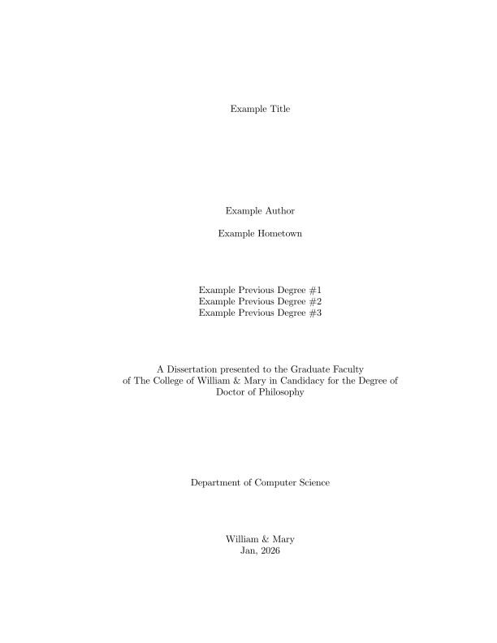

# Unofficial Typst template for W&M Computer Science thesis and dissertations

This Typst template is reconstructed from the PDF files produced by a corresponding LaTeX template.

## Caveats

* The reconstructed Typst template may not be 100% accurate. Please check whether the output layout conforms to the official requirements.

* Typst’s bibliography engine (Hayagriva) cannot distinguish `@mastersthesis` and `@phdthesis`.

  You need to set `type = {Master's thesis}` or `type = {PhD thesis}` in your BibTeX file so the bibliography shows the correct type.

  The original template renders `@mastersthesis` as upright and `@phdthesis` as italic, but this template renders both as italic due to this limitation.

## Preview

